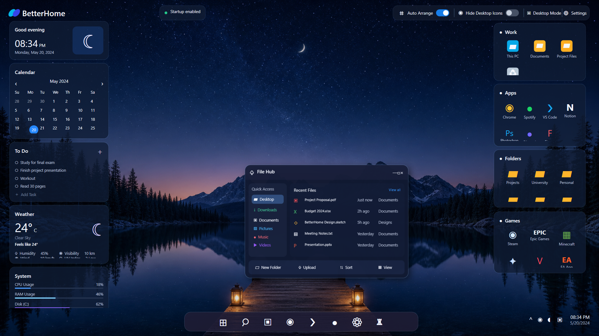

# BetterHome

BetterHome is an open-source customizable desktop shell for Windows, built with .NET 8 and WPF.



**Version:** 1.0-beta  
**Developed by:** ziyad3laa

## Features

- Custom desktop groups with real files, folders, and application icons
- File Hub with navigation, tabs, search, file operations, and multiple view modes
- Custom dock integrated with Windows Start and Windows Search
- Live running-app icons and open-window switching
- Widgets for calendar, tasks, weather, system usage, and prayer times
- Live wallpapers, themes, Smart Tray, Mini Player, and local desktop assistant
- Persistent layouts and settings stored under `%AppData%\BetterHome`

## Requirements

- Windows 10 or Windows 11
- [.NET 8 Desktop Runtime](https://dotnet.microsoft.com/download/dotnet/8.0)

## Build from source

```powershell
git clone https://github.com/ziyad3laa/BetterHome.git
cd BetterHome
dotnet restore
dotnet build BetterHome.sln -c Release
dotnet run --project BetterHome/BetterHome.csproj
```

## Publish

Framework-dependent:

```powershell
dotnet publish BetterHome/BetterHome.csproj -c Release -r win-x64 --self-contained false -o publish
```

Self-contained:

```powershell
dotnet publish BetterHome/BetterHome.csproj -c Release -r win-x64 --self-contained true -o publish
```

## Project structure

- `BetterHome/Models` — application data models
- `BetterHome/ViewModels` — MVVM view models
- `BetterHome/Views` — WPF views
- `BetterHome/Services` — Windows, filesystem, layout, and feature services
- `BetterHome/Assets` — application icons and bundled wallpaper

## Privacy

BetterHome stores its settings locally. Some optional widgets may access public internet services for live data. Review the relevant service implementation before distributing a customized build.

## Contributing

Issues and pull requests are welcome. Please test changes on Windows and keep UI changes consistent with the existing BetterHome design language.

## License

Licensed under the [MIT License](LICENSE).
